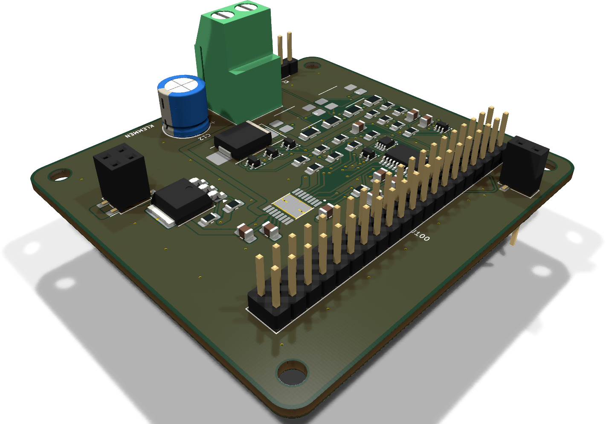
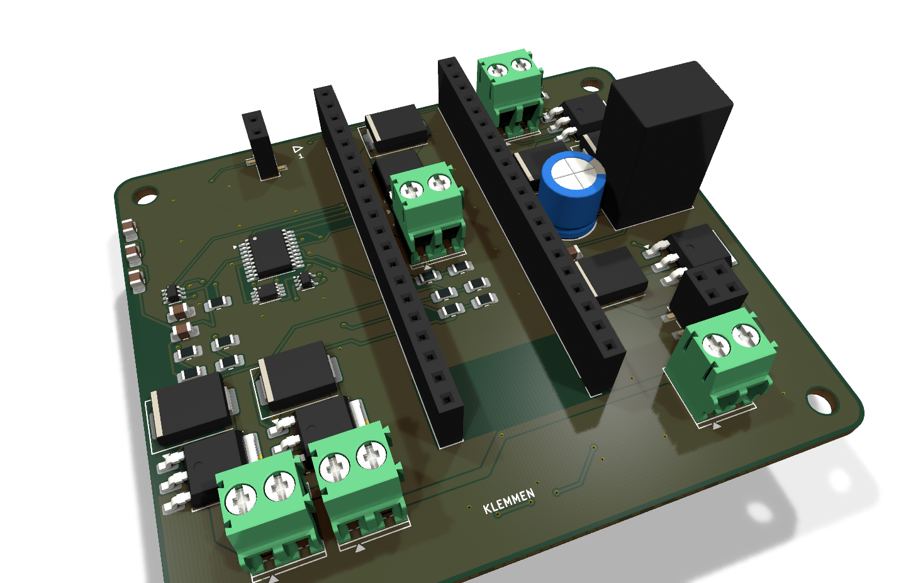
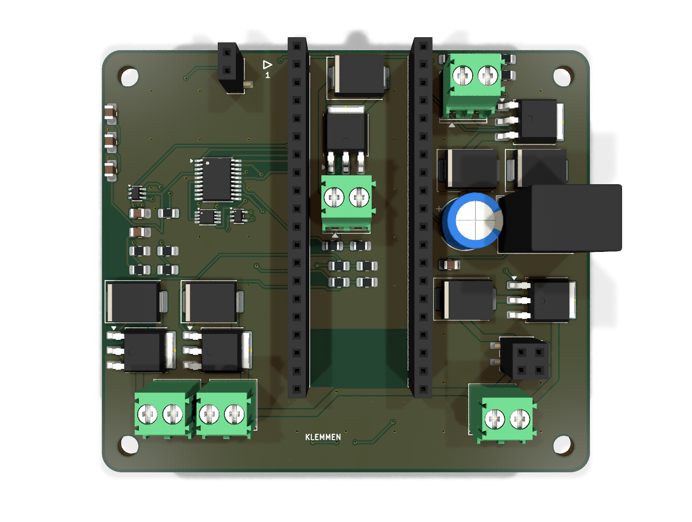

<p align="center">
  
</p>

<h1 align="center">PicoStack</h1>

<p align="center">
  <b>A stackable, contract-driven module system for the Raspberry Pi Pico.</b><br>
  Open hardware, generated by code, verified by tests that are proven to fail.
</p>

<p align="center">
  <a href="hardware/LICENSE"></a>
  <a href="LICENSE"></a>
  
  
</p>

<p align="center">
  
</p>

---

**One board plus a Pico is a working device.** PicoStack v2 abolishes the
separate base board that v1 needed: every 75 × 65 mm module now carries its
own 6–30 V supply (reverse-polarity protection, TVS, a K7805-1000R3
regulator, Schottky-OR into VSYS) and a pair of Pico-native 1×20 socket rows
(17.78 mm apart, the Pico's own pinout) — the Pico plugs straight into the
top of the stack and all 40 pins run down through it. Stack several fed
boards and they coexist; one is enough to power the whole chain. Every
module also breaks out its 18 spare Pico GPIOs plus 3V3/GND as labelled
solder pads on the board edge.

Power, I²C, emergency-stop and flashing signals run through the stack on
the same contract pinout v1 defined — v2 changed the connector geometry,
not a single pin's role — and any module can be flashed **through the
stack**, selected by a hardware token chain, without touching a cable.

The unusual part: **these boards are not drawn, they are built.** Schematics,
placement, routing, ground stitching and the manufacturing checks all come
from Python that runs headless against KiCad. The stack's mechanical and
electrical rules live in a single machine-readable file — the *contract*
(see the [design spec](docs/superpowers/specs/2026-09-07-picostack-v2-design.md)
for the full v2 rationale) — and every board is measured against it before
it may exist.

## Why you might care

- **You want motorized / sensor / whatever hats for the Pico** that stack
  instead of sprawling across a desk. Design one module and it composes
  with all the others.
- **You want to see a fully generative KiCad workflow** — schematic
  generators, placement specs, headless autorouting (freerouting 2.3),
  copper-pour healing, DRC gates — all reproducible from the command line.
- **You like tests that can actually fail.** Every check in this repository
  ships with a proof that it turns red when the thing it guards is broken.
  ERC and DRC caught *none* of the 14+ real bugs found during development —
  including a fail-unsafe emergency-stop gate (an intact loop blocked the
  motor, a broken wire released it) and a reverse-polarity FET wired so
  that reverse voltage crowbarred instead of being blocked. The custom
  gates caught all of them; that story is documented in the code.

## The stack at a glance

| Piece | What it is | State |
|---|---|---|
| **Contract** (`tools/stack_spec.py`) | Connector positions, pin roles, per-module supply rules, edge-pad positions, landing-point copper rules, mating rules — the single source of truth for anyone building a module | stable, v2 |
| **Motor module** (`hardware/kicad/motor/`) | DRV8876 H-bridge, STM32C011 co-processor, opto-isolated dual-channel e-stop loop, own 6–30 V supply cell | 75 × 65 mm, routed, DRC-clean |
| **Dimmer family** (`hardware/kicad/dimmer{1,3,4}/`) | 1/3/4-channel low-side LED dimmers from one parametric description, own supply cell each | 75 × 65 mm, routed, DRC-clean |
| **Base board** (`hardware/kicad/sockel/`) | v1's Pico socket + 24 V input + 5 V rail board | **v1-only, archived** — see [release v0.1.0](https://github.com/Meo98/picostack/releases/tag/v0.1.0); not part of v2, not updated to the v2 contract |
| **Toolchain** (`tools/`) | Schematic generators, board builder, autorouter driver, ground healer, contract probes | working, evolving |

<p align="center">
  
  
</p>
<p align="center">
  
  
</p>

## How a board gets built

```text
tools/sch/<board>.py      →  KiCad schematic (generated, ERC-clean)
tools/pcb/spec_<board>.py →  placement + pre-routes + stitching, no KiCad needed
tools/pcb/build.py        →  fresh .kicad_pcb from netlist + spec
tools/pcb/autoroute.py    →  freerouting 2.3 headless, DSN repaired on the fly
tools/pcb/masseheiler.py  →  finds isolated copper islands, heals them with vias
tools/pcb/steckerprobe.py →  measures the finished board against the contract
```

Every stage is a plain Python file you can read, run and extend. The
[website](https://meo98.github.io/picostack/) walks through the architecture in
detail.

## Building a module of your own

The contract is deliberately small. A module must:

1. use the 75 × 65 mm outline and M3 hole pattern from `stack_spec.py`,
2. place the two Pico-native socket rows and the two connector pairs at the
   contract positions (the helpers compute them for you — never type the
   coordinates),
3. give the board its own 6–30 V supply cell (reverse-polarity protection,
   TVS, Schottky-OR into VSYS) and bring every unused Pico GPIO out as a
   labelled edge pad,
4. keep the landing-point areas free of exposed copper, so a stack that is
   assembled rotated cannot short anything,
5. pass `tests/` and the contract probes against the built board.

Start by copying `tools/pcb/spec_motor.py` and
`tools/sch/motormodul.py`, then read
[CONTRIBUTING.md](CONTRIBUTING.md) — it describes the workflow, the
red-proof testing rule, and how to propose a new module.

**Module ideas we would love to see:** sensor hats, LED drivers, stepper
drivers, CAN/RS-485 bridges, audio, battery management — anything that
speaks the contract. Firmware in any language that runs on a Pico or the
module MCUs (C, MicroPython, Rust, …) is equally welcome.

## Repository layout

```text
hardware/kicad/     KiCad projects (generated .kicad_sch + built .kicad_pcb)
tools/stack_spec.py the contract
tools/sch/          schematic generators
tools/pcb/          board builder, router driver, probes, healer
tests/              plain-python test suites (no pytest needed)
docs/               project website (GitHub Pages)
```

## Building the boards yourself

You need KiCad 10, Python 3, and Java ≥ 25 for the bundled
freerouting 2.3 flow. Then:

```bash
python3 tests/run_all.py                 # every suite, no board tools needed
python3 tools/sch/motormodul.py          # regenerate a schematic
tools/pcb/kipy tools/pcb/build.py spec_motor \
  hardware/kicad/motor/Motormodul.kicad_pcb \
  hardware/kicad/motor/Motormodul.kicad_sch   # rebuild a board
```

(`kipy` is a small launcher that runs a script inside KiCad's Python.
See CONTRIBUTING for the full toolchain walkthrough.)

## Getting boards made

Gerbers, JLC-format BOM/CPL and pick-and-place files for all four v2 boards
live under `hardware/fertigung/{motor,dimmer1,dimmer3,dimmer4}/`, and ship as
ZIPs with every [release](https://github.com/Meo98/picostack/releases).
[`hardware/fertigung/ORDERING.md`](hardware/fertigung/ORDERING.md) walks
through ordering an assembled board at JLCPCB, including the traps that
already cost real money in v1 (a diode package mix-up, a rotation-preview
miss, a type-code encoding gotcha).

## License

- **Hardware** (everything under `hardware/`): [CERN-OHL-S-2.0](hardware/LICENSE) —
  strongly reciprocal: if you ship a derived board, you publish your changes.
- **Code** (tools, generators, firmware): [GPL-3.0-or-later](LICENSE).
- **Documentation**: CC-BY-SA 4.0.

## Project language

The public face of this project is English. The code comments are currently
German — they carry the full engineering rationale of every decision and are
being translated over time. New contributions should be in English.
