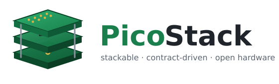
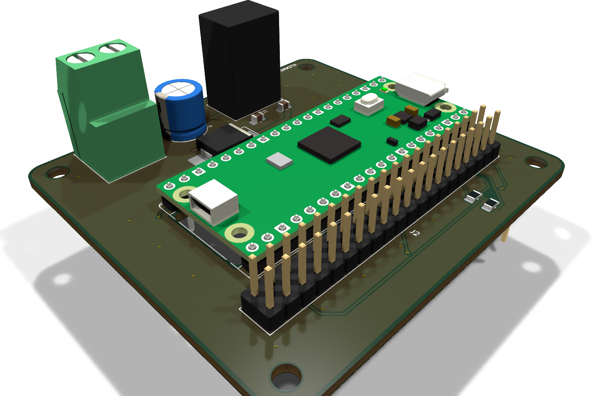
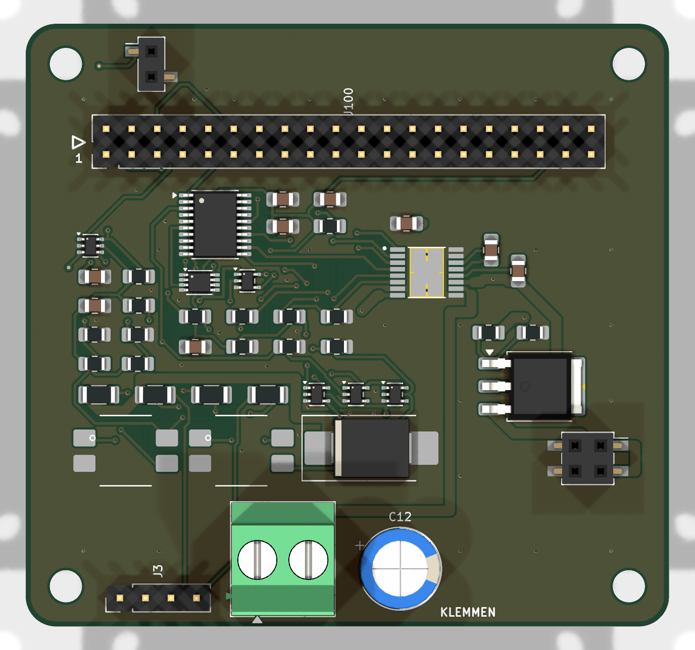
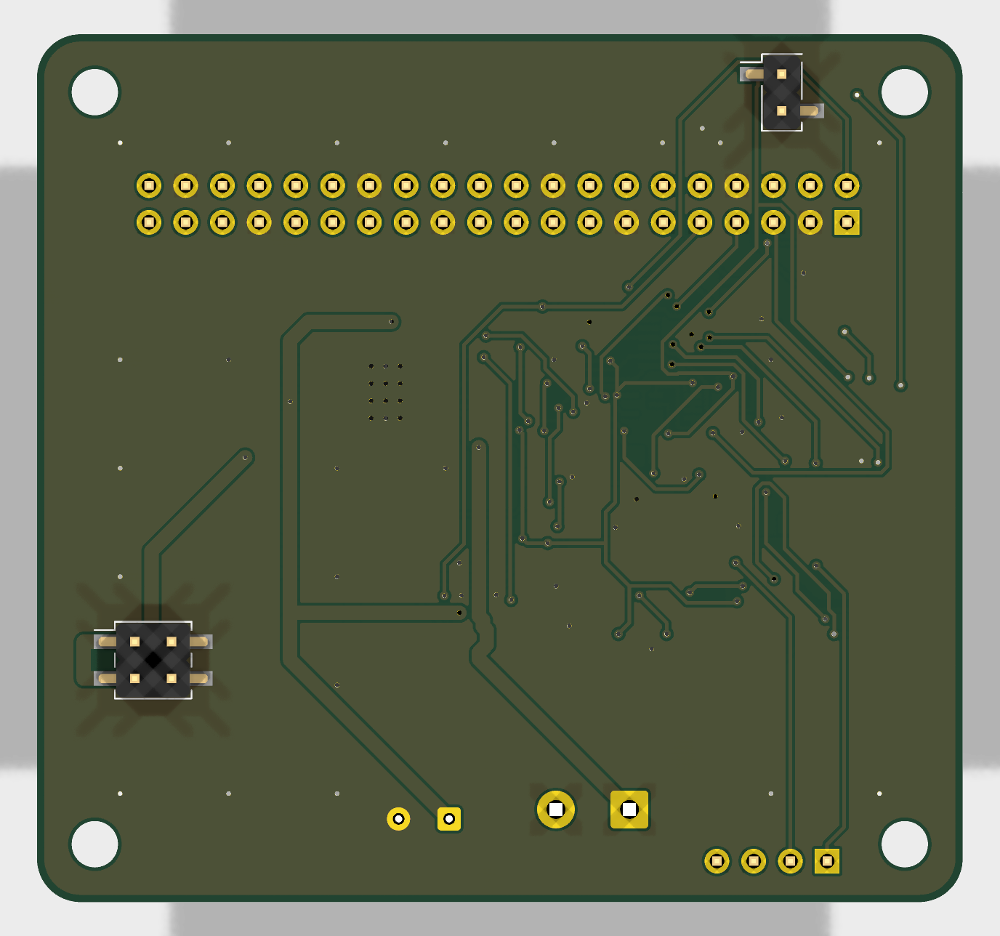

<p align="center">
  
</p>

<h1 align="center">PicoStack</h1>

<p align="center">
  <b>A stackable, contract-driven module system for the Raspberry Pi Pico.</b><br>
  Open hardware, generated by code, verified by tests that are proven to fail.
</p>

<p align="center">
  <a href="hardware/LICENSE"></a>
  <a href="LICENSE"></a>
  
  
</p>

<p align="center">
  
</p>

---

PicoStack is a family of 64 × 60 mm boards that stack on top of a Raspberry
Pi Pico base board. One base carries the Pico; every module above it gets
power, I²C, emergency-stop and flashing signals through a single 2×20
stacking connector — and any module can be flashed **through the stack**,
selected by a hardware token chain, without touching a cable.

The unusual part: **these boards are not drawn, they are built.** Schematics,
placement, routing, ground stitching and the manufacturing checks all come
from Python that runs headless against KiCad. The stack's mechanical and
electrical rules live in a single machine-readable file — the *contract* —
and every board is measured against it before it may exist.

## Why you might care

- **You want motorized / sensor / whatever hats for the Pico** that stack
  instead of sprawling across a desk. Design one module and it composes
  with all the others.
- **You want to see a fully generative KiCad workflow** — schematic
  generators, placement specs, headless autorouting (freerouting 2.3),
  copper-pour healing, DRC gates — all reproducible from the command line.
- **You like tests that can actually fail.** Every check in this repository
  ships with a proof that it turns red when the thing it guards is broken.
  ERC and DRC caught *none* of the ten real bugs found during development;
  the custom gates caught all of them. That story is documented in the code.

## The stack at a glance

| Piece | What it is | State |
|---|---|---|
| **Contract** (`tools/stack_spec.py`) | Connector positions, pin roles, keep-outs, landing-point copper rules, mating rules — the single source of truth for anyone building a module | stable |
| **Base board** (`hardware/kicad/sockel/`) | Pico socket, 24 V input, 5 V rail, token chain driver | routed, DRC-clean |
| **Motor module** (`hardware/kicad/motor/`) | DRV8876 H-bridge, STM32C011 co-processor, opto-isolated dual-channel e-stop loop | routed, DRC-clean |
| **Toolchain** (`tools/`) | Schematic generators, board builder, autorouter driver, ground healer, contract probes | working, evolving |

<p align="center">
  
  
</p>

## How a board gets built

```text
tools/sch/<board>.py      →  KiCad schematic (generated, ERC-clean)
tools/pcb/spec_<board>.py →  placement + pre-routes + stitching, no KiCad needed
tools/pcb/build.py        →  fresh .kicad_pcb from netlist + spec
tools/pcb/autoroute.py    →  freerouting 2.3 headless, DSN repaired on the fly
tools/pcb/masseheiler.py  →  finds isolated copper islands, heals them with vias
tools/pcb/steckerprobe.py →  measures the finished board against the contract
```

Every stage is a plain Python file you can read, run and extend. The
[website](https://meo98.github.io/picostack/) walks through the architecture in
detail.

## Building a module of your own

The contract is deliberately small. A module must:

1. use the 64 × 60 mm outline and M3 hole pattern from `stack_spec.py`,
2. place the three connector pairs at the contract positions (the helpers
   compute them for you — never type the coordinates),
3. keep the landing-point areas free of exposed copper, so a stack that is
   assembled rotated cannot short anything,
4. pass `tests/` and the contract probes against the built board.

Start by copying `tools/pcb/spec_motor.py` and
`tools/sch/motormodul.py`, then read
[CONTRIBUTING.md](CONTRIBUTING.md) — it describes the workflow, the
red-proof testing rule, and how to propose a new module.

**Module ideas we would love to see:** sensor hats, LED drivers, stepper
drivers, CAN/RS-485 bridges, audio, battery management — anything that
speaks the contract. Firmware in any language that runs on a Pico or the
module MCUs (C, MicroPython, Rust, …) is equally welcome.

## Repository layout

```text
hardware/kicad/     KiCad projects (generated .kicad_sch + built .kicad_pcb)
tools/stack_spec.py the contract
tools/sch/          schematic generators
tools/pcb/          board builder, router driver, probes, healer
tests/              plain-python test suites (no pytest needed)
docs/               project website (GitHub Pages)
```

## Building the boards yourself

You need KiCad 10, Python 3, and Java ≥ 25 for the bundled
freerouting 2.3 flow. Then:

```bash
python3 tests/run_all.py                 # every suite, no board tools needed
python3 tools/sch/motormodul.py          # regenerate a schematic
tools/pcb/kipy tools/pcb/build.py spec_motor \
  hardware/kicad/motor/Motormodul.kicad_pcb \
  hardware/kicad/motor/Motormodul.kicad_sch   # rebuild a board
```

(`kipy` is a small launcher that runs a script inside KiCad's Python.
See CONTRIBUTING for the full toolchain walkthrough.)

## License

- **Hardware** (everything under `hardware/`): [CERN-OHL-S-2.0](hardware/LICENSE) —
  strongly reciprocal: if you ship a derived board, you publish your changes.
- **Code** (tools, generators, firmware): [GPL-3.0-or-later](LICENSE).
- **Documentation**: CC-BY-SA 4.0.

## Project language

The public face of this project is English. The code comments are currently
German — they carry the full engineering rationale of every decision and are
being translated over time. New contributions should be in English.
